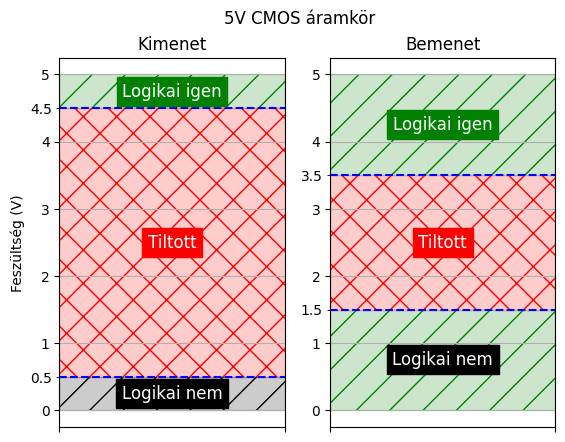
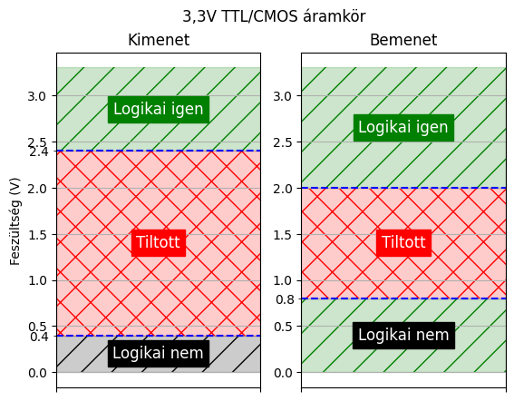
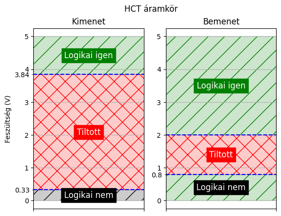
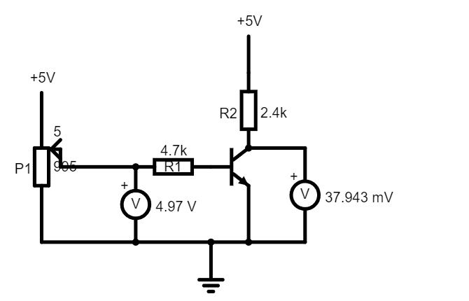
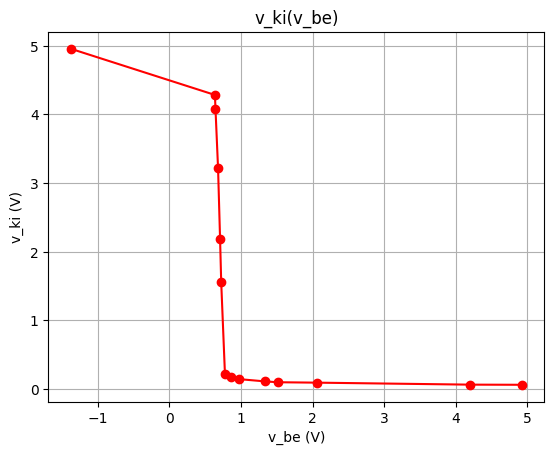
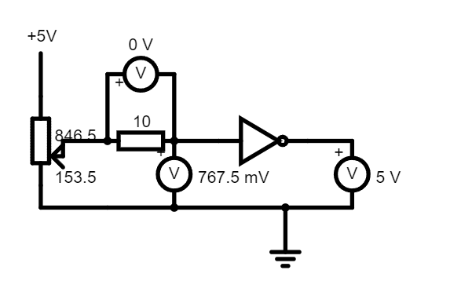
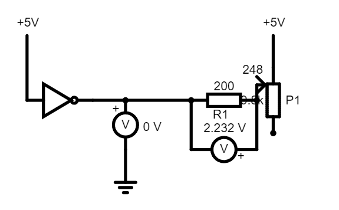
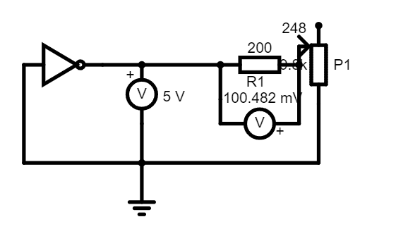
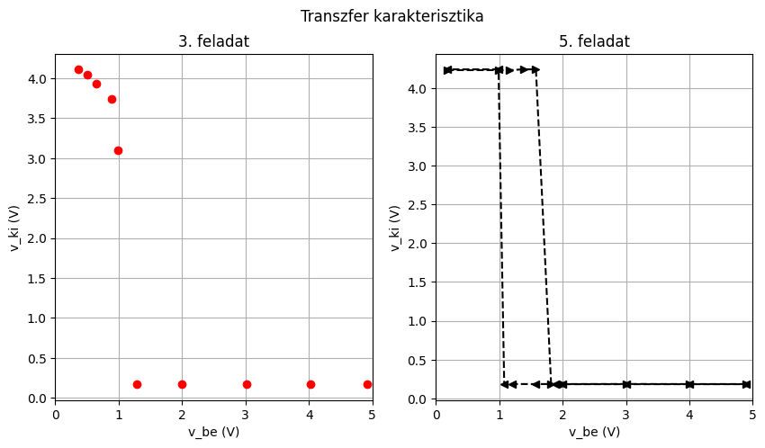

# Jegyzőkönyv 1 számolások


```python
import pandas as pd
import numpy as np
import matplotlib.pyplot as plt
```

## 1. feladat


```python
def logic_plot_generator(inp_false_cutoff, inp_true_cutoff, inp_label, out_false_cutoff, out_true_cutoff, out_label, title, volt_min = 0, volt_max = 5) -> None:
    TRUE_VAL = 1
    FALSE_VAL = 0

    fig = plt.figure()
    fig.suptitle(title)
    ax1 = plt.subplot(122)
    
    ax1.set_title('Bemenet')
    plt.yticks(np.arange(volt_min, volt_max, 0.5), minor=True)
    plt.axhline(y=inp_false_cutoff, color='blue', linestyle='--', label=f'{inp_false_cutoff}V')
    plt.axhline(y=inp_true_cutoff, color='blue', linestyle='--', label=f'{inp_true_cutoff}V')
    ax1.set_yticks([inp_false_cutoff, inp_true_cutoff], [f'{inp_false_cutoff}', f'{inp_true_cutoff}'], minor=True)
    
    plt.axhspan(volt_max, inp_true_cutoff, color='green', alpha=0.2, label='Igaz tartomány')
    plt.axhspan(volt_max, inp_true_cutoff, color='green', fill=None, linewidth=0, hatch="/", alpha=1)
    plt.text(0.5, ((volt_max - inp_true_cutoff) / 2) + inp_true_cutoff, 'Logikai igen', fontsize=12, ha='center', va='center', color='white', backgroundcolor='green')

    plt.axhspan(inp_false_cutoff, inp_true_cutoff, color='red', alpha=0.2, label='Tiltott tartomány')
    plt.axhspan(inp_false_cutoff, inp_true_cutoff, color='red', fill=None, linewidth=0, hatch="X", alpha=1)
    plt.text(0.5, ((inp_true_cutoff - inp_false_cutoff) / 2) + inp_false_cutoff, 'Tiltott', fontsize=12, ha='center', va='center', color='white', backgroundcolor='red')
    
    plt.axhspan(inp_false_cutoff, volt_min, color='green', alpha=0.2, label='Hamis tartomány')
    plt.axhspan(inp_false_cutoff, volt_min, color='green', fill=None, linewidth=0, hatch="/", alpha=1)
    plt.text(0.5, ((volt_min - inp_false_cutoff) / 2) + inp_false_cutoff, 'Logikai nem', fontsize=12, ha='center', va='center', color='white', backgroundcolor='black')

    plt.tick_params(axis='x', labelbottom=False)
    plt.xticks([FALSE_VAL, TRUE_VAL], ['0', '1'])
    plt.grid(True, which='both')

    ax2 = plt.subplot(121, sharex=ax1)
    ax2.title.set_text('Kimenet')
    plt.axhline(y=out_false_cutoff, color='blue', linestyle='--', label=f'{out_false_cutoff}V')
    plt.axhline(y=out_true_cutoff, color='blue', linestyle='--', label=f'{out_true_cutoff}V')
    ax2.set_yticks([out_false_cutoff, out_true_cutoff], [f'{out_false_cutoff}', f'{out_true_cutoff}'], minor=True)
    
    plt.axhspan(volt_max, out_true_cutoff, color='green', alpha=0.2, label='Igaz tartomány')
    plt.axhspan(volt_max, out_true_cutoff, color='green', fill=None, linewidth=0, hatch="/", alpha=1)
    plt.text(0.5, ((volt_max - out_true_cutoff) / 2) + out_true_cutoff, 'Logikai igen', fontsize=12, ha='center', va='center', color='white', backgroundcolor='green')

    plt.axhspan(out_false_cutoff, out_true_cutoff, color='red', alpha=0.2, label='Tiltott tartomány')
    plt.axhspan(out_false_cutoff, out_true_cutoff, color='red', fill=None, linewidth=0, hatch="X", alpha=1)
    plt.text(0.5, ((out_true_cutoff - out_false_cutoff) / 2) + out_false_cutoff, 'Tiltott', fontsize=12, ha='center', va='center', color='white', backgroundcolor='red')

    plt.axhspan(out_false_cutoff, volt_min, color='black', alpha=0.2, label='Hamis tartomány')
    plt.axhspan(out_false_cutoff, volt_min, color='black', fill=None, linewidth=0, hatch="/", alpha=1)
    plt.text(0.5, ((volt_min - out_false_cutoff) / 2) + out_false_cutoff, 'Logikai nem', fontsize=12, ha='center', va='center', color='white', backgroundcolor='black')

    plt.tick_params(axis='x', labelbottom=False)
    plt.ylabel('Feszültség (V)')
    plt.grid(True)
    plt.show()

logic_plot_generator(0.8, 2.0, 'Bemenet', 0.4, 2.7, 'Kimenet', 'TTL áramkör')
logic_plot_generator(1.5, 3.5, 'Bemenet', 0.5, 4.5, 'Kimenet', '5V CMOS áramkör')
logic_plot_generator(0.8, 2.0, 'Bemenet', 0.4, 2.4, 'Kimenet', '3,3V TTL/CMOS áramkör', 0, 3.3)
logic_plot_generator(0.8, 2.0, 'Bemenet', 0.33, 3.84, 'Kimenet', 'HCT áramkör')
```


    

    


    

    


    

    


    

    


### Ábrázolások

## 2. feladat

### Szimulátor
[](https://falstad.com/circuit/circuitjs.html?ctz=CQAgLCAMB0l3BWEBGGAmOaDsWDMkAONANgE5SsQFIrxcqBTAWmWQCgAlFZNEU47rzAEoosDSQ0p0BGwDmINAgHJSvJQLRoIUtsiwRWvfoJTEayFPCixISDgwDOAS0cAXAIYA7AMYM2AA4oaihoIqq8ESD0ugDupsjmCSGQbPFGwZEhUanp2SEamVBpRTzhYaEiqQBOpRWFZWJYcGxuisqVigTlVSg2CGriYKQIJLhqxMSWMMT4uMLIuATIYCSkYEioNAAmDABmHgCuADZuJWHhYBAXRbld4QUdOefdRbi4Kikv4TzRH6apILvFS-YFvUQ1e7gEQ3DI0bQtLg3YRQqRiCQQ-psAAeIAIpBQ8ys9EWlEMvAACuxcWM8ZRsCJSDRySAOGgcYpEoT1LhLIskCyOOwgA)

### Mérések és ábrák


```python
v_be = pd.array([
        4.93,
        4.1,
        3.26,
        2.1,
        1.074,
        0.955,
        0.88,
        0.849,
        0.796,
        0.7,
        0.658,
        0.602,
        0.543,
        0.251,
        0.1
])

v_ki = pd.array([
        0.020,
        0.022,
        0.026,
        0.037,
        0.0732,
        0.086,
        0.098,
        0.104,
        0.121,
        0.1562,
        3.45,
        4.69,
        4.97,
        4.97,
        4.97
])

# plot v_ki by v_be
plt.plot(v_be, v_ki, 'ro')
plt.title('v_ki(v_be)')
plt.xlabel('v_be (V)')
plt.ylabel('v_ki (V)')
plt.xlim(left=0, right=5)
plt.grid()
plt.show()

# create table and show it
table = pd.DataFrame({'v_be': v_be, 'v_ki': v_ki})
print(table)
```


    

    


         v_be    v_ki
    0    4.93    0.02
    1     4.1   0.022
    2    3.26   0.026
    3     2.1   0.037
    4   1.074  0.0732
    5   0.955   0.086
    6    0.88   0.098
    7   0.849   0.104
    8   0.796   0.121
    9     0.7  0.1562
    10  0.658    3.45
    11  0.602    4.69
    12  0.543    4.97
    13  0.251    4.97
    14    0.1    4.97
    

## 3-4-5. feladat

### Áramkörök

#### Átmeneti függvény vizsgálat
[](https://falstad.com/circuit/circuitjs.html?ctz=CQAgLCAMB0l3BWEBGGAmOaDsWDMkAONANgE5SsQFIrxcqBTAWmWQCgAlEJhYmptAQLde-XLmJQpYGkhrzoCNgEluYXGm5pe3CcIE6FSJQHNdBCAMLnLyLJPlsADmuKXtkpmDdbr9R3aWolpCImDuMigo8FDQFsRIHAwAzgCWyQAuAIYAdgDGDGwA7mHuOjzImgYOxa5lnupVHlC1Xj5W+rgWvsKQrcECaEF8PS0lPCMdIpWjfS5M4p7NCxKj-mO6xPrLi1qGrbtTC91TfQBO003l3vVSqP0z1Ze6kBB94zd7De34bw9N1ja7msc2eC1edReEHWfSAA)

#### Logikai igaz vizsgálat
[](https://falstad.com/circuit/circuitjs.html?ctz=CQAgLCAMB0l3BWEBGGAmOaDsWDMkAONANgE5SsQFIrxcqBTAWmWQCgAlEJhYmptL269+uXMSiSwNJDTnQEbAJLC+3QRKZhSmjZJhJFAd27bdQrcQgChkNgHNTV9YSfXkWCXLYAHN+oswZwFXem8TS2s9LTgArzYAJ1NYm00xcy8QDDsPa1wMdTQ8goEsNBQUeHkKBGyq+uQQDgYAZwBLFoAXAEMAOwBjBk5ufP40AgIRkvT9cBlZgzYADxGsUnVcSaZxKNwkCGRyjnYV7dcbcoFSKO1wFHKABXYI6THAlIxJuwiZ1JHxFxfXz-XTnV6AkBhKBsIA)

#### Logikai hamis vizsgálat
[](https://falstad.com/circuit/circuitjs.html?ctz=CQAgLCAMB0l3BWEBGGAmOaDsWDMkAONANgE5SsQFIrxcqBTAWmWQCgBJEJhYmptL25hSxboLE0YSBGwDuw0eKFMwxCAKGQ2Ac2HruyLGNUGWYCFLYAHfRol3xhEPSsLT9lWDjLJbAE7CPpomuLgmDjQY2kYauBjiaHEJAlhoKCjwUtAUCNFZBcggAEoMAM4AlmUALgCGAHYAxgxsAB7cuFik4rgEHWZouEgQyOnF7O1M+H2a6QKk9iLgKOkACuzu3vwOqsEYfdruYREqx04HNh3h50Hbzq5Q8h0paEnP-EZ+m2af74bGj2+9mcHn+X0cLABPD4YMB3F4HyhCN8jyAA)


```python
fel3_v_be = pd.array([
    0.361,
    0.51,
    0.652,
    0.885,
    0.986,
    1.280,
    2,
    3.02,
    4.03,
    4.92,
])

fel3_v_ki = pd.array([
    4.11,
    4.04,
    3.93,
    3.74,
    3.1,
    0.171,
    0.172,
    0.172,
    0.172,
    0.172,
])

table = pd.DataFrame({'v_be': fel3_v_be, 'v_ki': fel3_v_ki})
print(table)

fel5_v_be = pd.array([
    0.176,
    0.99,
    1.165,
    1.39,
    1.58,
    1.82,
    2,
    3,
    4,
    4.9
])

fel5_v_ki = pd.array([
    4.23,
    4.23,
    4.23,
    4.24,
    4.24,
    0.182,
    0.182,
    0.182,
    0.182,
    0.182,
])

fel5_v_back_be = pd.array([
    4.9,
    4,
    3,
    2,
    1.89,
    1.58,
    1.21,
    1.08,
    0.99,
    0.176,
])

fel5_v_back_ki = pd.array([
    0.184,
    0.184,
    0.185,
    0.184,
    0.184,
    0.184,
    0.184,
    0.184,
    4.24,
    4.24,
])

table = pd.DataFrame({'v_be - Fel': fel5_v_be, 'v_ki - Fel': fel5_v_ki, 'v_be - Le': fel5_v_back_be, 'v_ki - Le': fel5_v_back_ki})
print(table)

# plot v_ki by v_be, then i_be by v_be
fig, ax = plt.subplots(ncols=2, figsize=(10, 5))
fig.suptitle('Transzfer karakterisztika')

ax[0].plot(fel3_v_be, fel3_v_ki, 'ro')
ax[0].title.set_text('3. feladat')
ax[0].set_xlabel('v_be (V)')
ax[0].set_ylabel('v_ki (V)')
ax[0].set_xlim(left=0, right=5)
ax[0].grid()

ax[1].plot(fel5_v_be, fel5_v_ki, 'k>--', fel5_v_back_be, fel5_v_back_ki, "k<--")
ax[1].title.set_text('5. feladat')
ax[1].set_xlabel('v_be (V)')
ax[1].set_ylabel('v_ki (V)')
ax[1].set_xlim(left=0, right=5)
ax[1].grid()
```

        v_be   v_ki
    0  0.361   4.11
    1   0.51   4.04
    2  0.652   3.93
    3  0.885   3.74
    4  0.986    3.1
    5   1.28  0.171
    6    2.0  0.172
    7   3.02  0.172
    8   4.03  0.172
    9   4.92  0.172
       v_be - Fel  v_ki - Fel  v_be - Le  v_ki - Le
    0       0.176        4.23        4.9      0.184
    1        0.99        4.23        4.0      0.184
    2       1.165        4.23        3.0      0.185
    3        1.39        4.24        2.0      0.184
    4        1.58        4.24       1.89      0.184
    5        1.82       0.182       1.58      0.184
    6         2.0       0.182       1.21      0.184
    7         3.0       0.182       1.08      0.184
    8         4.0       0.182       0.99       4.24
    9         4.9       0.182      0.176       4.24
    


    

    

