# Jegyzőkönyv 2 számolások


```python
import pandas as pd
import numpy as np
import matplotlib.pyplot as plt
import schemdraw
from schemdraw import logic
from schemdraw.parsing import logicparse
```

## 1. feladat: Programozható igazságtábla

Ha V vonalon jel van, akkor X jelet invertáljuk, ha V vonalon nincs jel, akkor X értékét adjuk át.

*ez egy XOR kapu*


```python
truth_table = """
Q | V | Y
---------
0 | 0 | 0
0 | 1 | 1
1 | 0 | 1
1 | 1 | 0
"""

logic.Table(truth_table, colfmt='c|c||c', fontsize=18, font="times new roman")
```


    
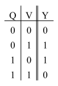
    


```python
logicparse('Q ⊕ V', outlabel="Y")
```


    
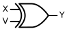
    


```python
logicparse('(Q and not V) or (not Q and V)', outlabel="Y")
```


    
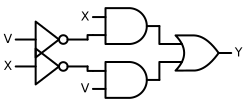
    


## 2. feladat: Jel választó

S jellel ki tudjuk választani, hogy X0 (hamis) vagy X1 (igaz) értéket adjuk kimenetnek


```python
truth_table = """
 S | X0 | X1 | Y
----------------- 
 0 | 0  | X  | 0
 0 | 1  | X  | 1
 1 | X  | 0  | 0
 1 | X  | 1  | 1
"""

logic.Table(truth_table, colfmt='c|c|c||c', fontsize=18, font="times new roman")
```


    
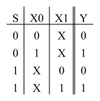
    


```python
logicparse('(S and X0) or (not S and X1)', outlabel="Y")
```


    
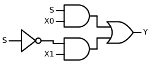
    


## 3. feladat: 4=>1 dekódoló

Egy két bites csatornán érkező kódot kell dekódolni négy csatornára. Az a csatorna lesz hamis értékű, amelyik ki van választva


```python
truth_table = """
A0 | A1 | Y0 | Y1 | Y2 | Y3
============================
 0 | 0  | 0  | 1  | 1  | 1
----------------------------
 0 | 1  | 1  | 0  | 1  | 1
----------------------------
 1 | 0  | 1  | 1  | 0  | 1
----------------------------
 1 | 1  | 1  | 1  | 1  | 0
"""

logic.Table(truth_table, colfmt='c|c||c|c|c|c', fontsize=18, font="times new roman")
```


    
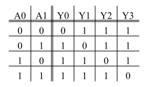
    


```python
logicparse('A1 or A0', outlabel="Y0")
```


    
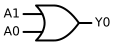
    


```python
logicparse('not A0 or A1', outlabel="Y1")
```


    
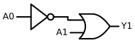
    


```python
logicparse('A0 or not A1', outlabel="Y2")
```


    
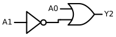
    


```python
logicparse('A1 nand A0', outlabel="Y3")
```


    
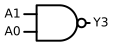
    


### Szimulátor
[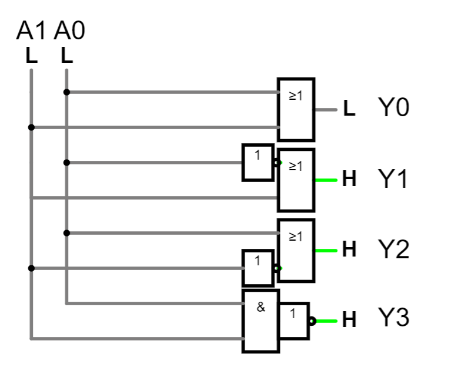](https://falstad.com/circuit/circuitjs.html?ctz=CQAgjCAMB0l3BWcMBMcUHYMGZIA4UA2ATmIxAUgpABZsKBTAWjDACgAZEJ7FcFPN14hihKOIBmAQwA2AZwbVIncWAHjR4qtPmKkygLIgUKGuBpmUCMWAviU0BGyMnL+Y9ePuqDpy9Mg2NhiVmJBYj6OzsYBmHyhxhh8kU4AHsYE4JSBrFn0lmYAmsrpAvFgSNi5KGCCBSCF7KWZmMQ5EGW0xkUobM182DQQVcN29YXYfdw0YnhULOR4+d0gAIJN3Gogc+CLywGrygDuQnxqgjxnhFTKFWfEZ3au5mY+4k4nYA-g16c-N2xPt9zqp1MoAJLgb7hGJmGE3RwUNgVKhgX4wr4DYL2d6A0GCVHfY5-Z6Y2FQPGXf5-MnEwlXekUk5UtHzYQCAmU4TYBAMwK8pnU3g3QJoQVUYX2TzEqnPFlEtiQ1lQ+6qrSIj6qInk24CsloQTPA04pBOO4qxLxWJJE1IpW-DkWx0I0145WO2V4TnM9lev485Ju74JHzSvGhiI6thAA)

### Alkatrészek
- 1 db OR kapu (3 felhasználás)
- 1 db NOT kapu (3 felhasználás)
- 1 db AND kapu (1 felhasználás)

# 4. feladat: 4 bemenetű prioritásdekódoló


```python
truth_table = """
X0 | X1 | X2 | X3 | Y1 | Y0
============================
 X | X  | X  | 1  | 1  | 1
----------------------------
 X | X  | 1  | 0  | 1  | 0
----------------------------
 X | 1  | 0  | 0  | 0  | 1
----------------------------
 1 | 0  | 0  | 0  | 0  | 0  
"""

logic.Table(truth_table, colfmt='c|c|c|c||c|c', fontsize=18, font="times new roman")
```


    
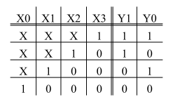
    


### Szimulátor
[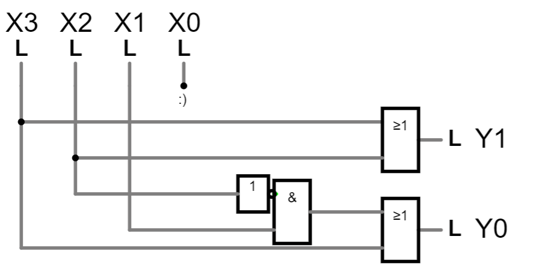](https://falstad.com/circuit/circuitjs.html?ctz=CQAgjCAMB0l3BWcMBMcUHYMGZIA4UA2ATmIxAUgpABZsKBTAWjDACgAZEJ7FcFPN14hihKOIBmAQwA2AZwbVIbAB7caYvFRbk89GiBQGAGtlWGQWkNgh7ahkyk7gxYAS5FiqVafMVJlNUpLKgxiS30HEGN2LkIDN0F4z3EfWQUlc2JBKzddSKNo5S5WPkTwNxTvEF8MgLYAdyEy9x4ywm9G5pcqAUEwDqg2AFlrNEMEMWwEPhRJ8RRoBHNsDF7CemxSQ0IxA0KATUDrNfA7LfCwPD2og-ZR3iowDCmZ8BeFpbYwN773qfGzy8FioyyaA34-VcxD4ynB0NmeH6MKGP0RgjmAN68164jB3QG2mEmFhXTahgw6IppKayUxIGS5WUAEkeoZCmAUShCt4lhRvsFObMaL1CkZqrD+U1ufsRYYkQ5OrT9vMhRMvF1CeyEmIZUN4eAURC9ccwJByGAaAlLeAaOQEnwAFwASjYQA)

### Alkatrészek
- 1 db OR kapu (2 felhasználás)
- 1 db NOT kapu (1 felhasználás)
- 1 db AND kapu (1 felhasználás)

### Magyarázat

- A maximum prioritásnál nem kell kezelni a többi esetet, mivel "úgy is minden fel van kapcsolva"
- A minimum prioritásnál nem kell semmit bekötni, és így "semmi nem fog bezavarni"
- Az X2 bemenetet tudja zavarni az X1 bemenet, ezért egy ellenőrző áramkört rakunk X1 kimenetére (Y0), hogy ha az X2 bemenet is be van kapcsolva, akkor ne kapcsoljon ki az X1 kimenete (Y0)
