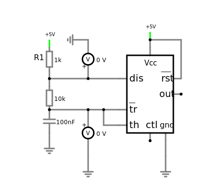

# Jegyzőkönyv 4 számolások

## 1. feladat

### Szimulátor

[](https://falstad.com/circuit/circuitjs.html?ctz=CQAgLCAMB0l3BWEBmAHAJmgdgGzoRgIxjICcpkOECkISJdApgLSGEBQhOS+OIhpdCHRYhAoX0ic84VLV6zayZHyEATRgDMAhgFcANgBdm+xmv5RLMSBwDmilCocrUV9gCUU6WsQjJv-IRCtLRgtEghUNAIHoFiOD5B-OiukWF0VlExAE5x-Al53qn88FIAHiBy-Kh8hHDVpOD5IO4cAO6FkK5sQujoEFIdPcL9helSucP9ib2oxUGl7ADGhXN5ypJRpYT82H0UaAgIJGBYYKgDsDbs9sMb6zjFg8IIqqNTo89Ta30QKansDq-YQ-V4ggFA0b-EZ+ALPYH+eRgxFQG4oBBCNB+DHgLhuDrIHFY9GYnHPFG+FAXfhgAaAqkQSnE4HkgJMtkFCYMl58c5IzZ1ODsIA)

### Számolás - a) feladat


```python
F = 0.56
T = 1 / F
C = 10 * 10 ** -6

R = T / (0.7 * C)
print(f"Time: {T}, Resistance: {R}, BPM: {60 / T }")

R1 = 10000
R2 = 120000
R_c = R1 + 2*R2

print(f"R1={R1}, R2={R2}, R={R_c}")
T_c = 0.7 * R_c * C
print(f"Time={T_c}, BPM={60 / T_c}")

```

    Time: 1.7857142857142856, Resistance: 255102.04081632654, BPM: 33.6
    R1=10000, R2=120000, R=250000
    Time=1.7499999999999998, BPM=34.28571428571429
    

### Számolás - b) feladat

[](https://falstad.com/circuit/circuitjs.html?ctz=CQAgLCAMB0l3BWEBmAHAJmgdgGzoRgIxjICcpkOECkISJdApgLSGEBQhOS+OIhpdCHRYhAoX0ic84VLV6zayZHyEATRgDMAhgFcANgBdm+xmv5RLMSBwDmilCocrUV9gCUU6WsQjJv-IRCtLRgtEghUNAIHoFiOD5B-OiukWF0VlExAE5x-Al53qn88FIAHiBy-Kh8hHDVpOD5IO4cAO6FkK5sQujoEFIdPcL9helSucP9ib2oxUGl7ADGhXN5ypJRpYT82H0UaAgIJGBYYKgDsDbs9sMb6zjFg8IIqqNTo89Ta30QKansDq-YQ-V4ggFA0b-EZ+ALPYH+eRgxFQG4oBBCNB+DHgLhuDrIHFY9GYnHPFG+FAXfhgAaAqkQSnE4HkgJMtkFCYMl58c5IzZ1ODsIA)


```python
F = 660
T = 1 / F
C = 100 * 10 ** -9

R = T / (0.7 * C)
print(f"Time: {T}, Resistance: {R}, BPM: {60 / T }")

R1 = 1000
R2 = 10000
R_c = R1 + 2*R2

print(f"R1={R1}, R2={R2}, R={R_c}")
T_c = 0.7 * R_c * C
print(f"Time={T_c}, F={1/T_c}, BPM={60 / T_c}")

```

    Time: 0.0015151515151515152, Resistance: 21645.021645021643, BPM: 39600.0
    R1=1000, R2=10000, R=21000
    Time=0.00147, F=680.2721088435375, BPM=40816.32653061225
    

## 2. feladat

### Szimulátor

[](https://falstad.com/circuit/circuitjs.html?ctz=CQAgLCAMB0l3BWEBmAHAJmgdgGzoRgIxjICcpkOECkISJdApgLSGEBQhOS+OIhpdCHRYhAoXzDRyM8jXhwOXIWFS1e4NSmR8hAE0YAzAIYBXADYAXZucZ7+URzEgcA5ptrIdHlDlRP2ACUUdFpiCGRQ-kIhWlowWiQ4qGgEdgAnaLEwCDYhUP8w0Ph2AA8QLUJUPkI4flRScH4+QI4AdyzhSH884XQISHYAY070VB6Y7T442Dh0AVlF2ULoVRwsHKxSGN5CFMV2d16vGsmdQqh2DvR+4XHhBF17wevbsf8biKiXvq-1R5CcUOKAQQjQEVB4C4AQ6yEh4JBYMhP0iYRyKFQuXRKMx-HRCM+l1hUXCgOaQMyYGhGlU-2m-BKAEkMRAadSATMkGkOr13qNbj9CXzec8rg9dLdxL9LiMpYS5Rz+LMFCqFIQWFhwNIlssyCsDkdBOL+EaRLEiSb8pKjVLBpkpaSHUbPMgSsS0bkbdixQ70b1SYMgA)

### Számolás


```python
T = 30
C = 220 * 10 ** -6

R = T / (1.1 * C)
print(f"Time: {T}, Resistance: {R}, BPM: {60 / T }")

R_c = 120000

print(f"R1={R_c}")
T_c = 1.1 * R_c * C
print(f"Time={T_c}, BPM={60 / T_c}")

```

    Time: 30, Resistance: 123966.94214876032, BPM: 2.0
    R1=120000
    Time=29.04, BPM=2.066115702479339
    
