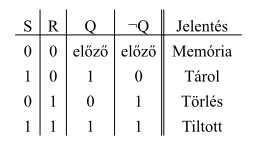
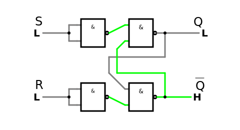
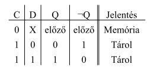
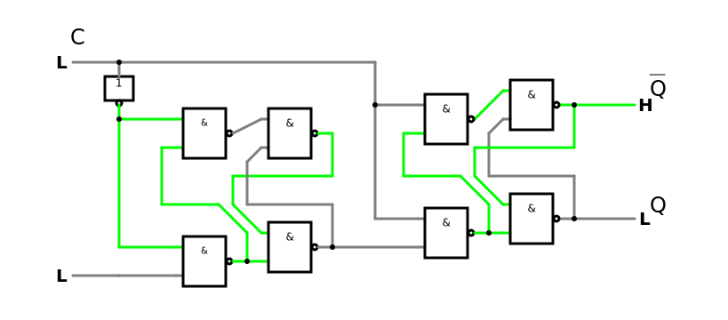

# Jegyzőkönyv 5 számolások


```python
from schemdraw import logic
from sympy import symbols
```

## 1. feladat: RS tároló


```python
a1, a0, b1, b0 = symbols('a1,a0,b1,b0')

truth_table = """
S | R| Q     |¬Q     | Jelentés
-------------------------------
0 | 0| előző | előző | Memória
1 | 0| 1     | 0     | Tárol
0 | 1| 0     | 1     | Törlés
1 | 1| 1     | 1     | Tiltott
"""

logic.Table(truth_table, colfmt='c|c|c|c||c', fontsize=18, font="times new roman")
```


    

    


### Áramkör

[](https://www.falstad.com/circuit/circuitjs.html?ctz=CQAgjCAMB0l3BWcMBMcUHYMGZIA4UA2ATmIxAUgpABZsKBTAWjDACgAZEJmvcGmt1Yp+gqlQBmAQwA2AZwbVInbrxCYRLMCI1Q90+YqTKAsqPMoUgsAL0poCNmZuDdaPrqr3HAD3WQIMFx1MGJwbHpXQQBFNj80JBQEDxR6IghCdRi4oTBM7TCWOHCRKJAAZRytTKTMplJ1BDCygCU2MAQIJmwRFxAe8y9qRw6ugd1xjBEhpEcAd1U+Pp4llD5lBZXzLbzxNk21Xe4Bo43F8DXj3suzrd07hEzbtVqrxqf98-uXvHXPu9+bzWf1GIEI1ls2iWtiGVBGnTBrimFw8yJmFE+fSxkOI00xOJEJ1xUE+RMJOisJIW40p4PeVIsyL6ljE+NclJelLOnMEhwwHwWfMydNOpJ0yLpwIZJ1sIpubPMUMGCt0Ss8bCAA)

## 2. feladat: D tároló


```python
a1, a0, b1, b0 = symbols('a1,a0,b1,b0')

truth_table = """
C | D| Q     |¬Q     | Jelentés
-------------------------------
0 | X| előző | előző | Memória
1 | 0| 0     | 1     | Tárol
1 | 1| 1     | 0     | Tárol
"""

logic.Table(truth_table, colfmt='c|c|c|c||c', fontsize=18, font="times new roman")
```


    

    


### Áramkör

[](https://www.falstad.com/circuit/circuitjs.html?ctz=CQAgjCAMB0l3BWcMBMcUHYMGZIA4UA2ATmIxAUgpABZsKBTAWjDACgAZEJ4wkQmtzCEqAqOIBmAQwA2AZwbVInbrxC5BLEesiCqVafMVJlADyEIINTWGyCa5QSkEBhNmEvdsKcNfU+wPyofKgR3TyZvEBQ8PH9o2PEfJDCAd24aOOEqSIDtZXSmTPAYrwDS5Q8IMUDBMFLapOowqv4nDHK4zBDo8TTfOr9GsGIQtnTh0fiRsfSomfiUZyhxxeWxFAQ+AoHojt2lvVXGw9ou5Z3i0+KwDG3Vm7u28HyHrsSNxJ35vxqK46GQwaQQB7U6e1mtGE0RoVFhwVhK3SNGhrB88PA9SROjqpWw2D4am+aGiW3UBNJ9zmJMa+L49TixKoC28zJByNRU1Z4Cml2hzjhnMhGh5Pjp0QuqxF2RxouxKPp2mlrw59KxCpe+nCEHFAtocBh+l6oW15LV6INaKaKVNes2fBF9utFFtiIZsvdwWabAAkqo+HgcmorfpoDbCmoxDwA1qI+b-SVGato4mMll-nHUynutjs-tchDc2oRQWRZd3nErmTy5SXhKjhM+KciucG2n6+2ZTWYnEoj3sSd9nb9js9VaFiHjlNx1MxDsFlHI227W6pnr52vVwEsUza9zTrvTv2FqPEgtTifVhe18tGqO3X4L+z-MEyY7q2wALJQ+M0YM76Iwy-H9DVoNR10AsJzEoCAUHxCgRmiCknEEABFNhoMgCAwEgZJEJwpAmzQtggA)

## 3. feladat: 8 bites számláló

### Áramkör

[](https://falstad.com/circuit/circuitjs.html?ctz=CQAgLCAMB0l3BWEBmAHAJmgdgGzoRgIxjICcpkOEhISJtApgLSGEBQhOS+OIhp6EOiyD+g3mGjlp5BPHjsASinSQ+YCMlV9CgtWrBqk+qNARtlrUTjVW+6VFCeHaT-WbYAnHddu6hkI628mwAHiCotqi8hHB8qKTgfLyK7ADuPgGOdujoEJBsGTl5mXn6XqUuOahB9iEAxqU1mcjIvO7yNJhaGsi6qlikYFhkpnDsAOYtbS04tQUZPEIlxfmFTY65EA5B61tCzUs7UHslx-ta5Ysll0IIvLcFU8gIgmiar+Ccbusvb6gfN6fBYqWwaFAA9RrDLvKEQ7YlEG3YiabSccqcCCGNRLMBUO68Rz5JzGEAAMwAhgAbADODBOMMhuLiSwKnEECHBf1oAhQn0EABMGJSAK5UgAuTCpDAFfDcY3Y7NoXO0CF5t0FwopYsl0tlNBMMEgirwyu2zTVgnOICFoolUplcsNsBNHPBS0tBKENq1Ood+vlRvY3jApF4Hvd9yc6GQTxAeEB8ZukKuPKB4huwPWCb5GdRqc9SxzrOzN20xeaIIrjmLUZBhea1YZadBSfzJxDYYOjk55tqMYKnYeqpVJgHFVDD0+vdz0djHHxCH8dgQuEyRPlkhk2534CkO4PiUptPpIMnmSXon8VajhDXc2ya5vMXBD7hVeaKPjn+v2c-98-cFn0yN87A-TZAm-R92mzKNVBrQ5ILjN94KgoQXAxU0bGyfwuBifxNTtXVHQNNwXQXcRIK-PC4UI7V7T1J0yONCj4yo+9bzXOi-UY0iOldNiIJrODIO4hiSMDciMnPOxzxLIA)
