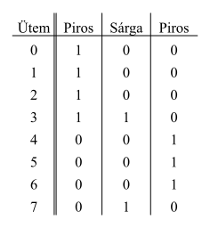
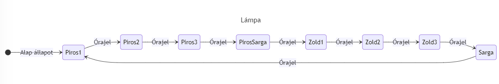
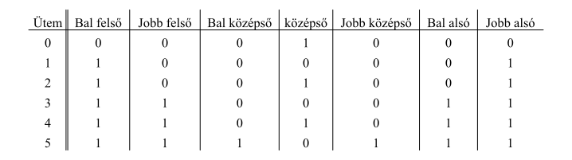
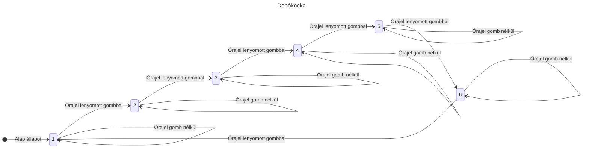
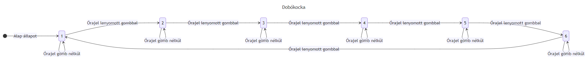
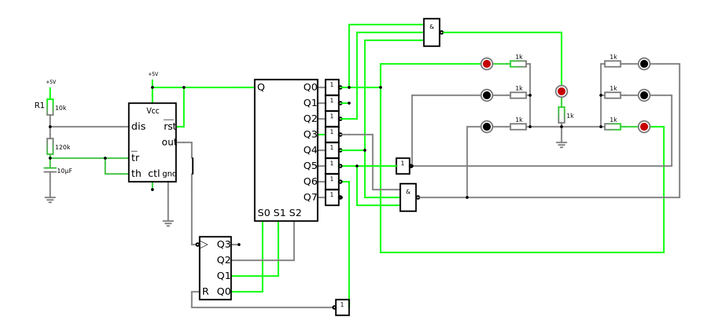

# Jegyzőkönyv 6 számolások


```python
from schemdraw import logic
from sympy import symbols
```

## 1. feladat: Jelzőlámpa-vezérlő

A feladat megoldásához egy NE555 által meghajtott számolót használunk, aminek a kimenete binárisan kódolja az ütemeket, ezt egy dekodolóval átalakítjuk az "ütemekre". 


```python
# three red, then one red-amber, then three green then amber
truth_table = """
Ütem | Piros | Sárga | Piros
-------------------------------
0    | 1    | 0     | 0
1    | 1    | 0     | 0
2    | 1    | 0     | 0
3    | 1    | 1     | 0
4    | 0    | 0     | 1
5    | 0    | 0     | 1
6    | 0    | 0     | 1
7    | 0    | 1     | 0
"""

logic.Table(truth_table, colfmt='c||c|c|c', fontsize=18, font="times new roman")
```


    

    


### Állapotok

### Áramkör

[](https://falstad.com/circuit/circuitjs.html?ctz=CQAgLCAMB0CMXUgNgMwCYUqdtsAcSaYAnMSPAKzgogUCmAtLLAFCxJVoVLnFohoA7P1h8QPMNFLTSFSPIWsASiHSRyYCGvKx+69WHVV9CCixXMRSdZfJo8UR4dqP90MwCcdVm7oGQHGwVIFgAPEDwbAnJ5cjwyCHYQJVYAd29-B1s0IigWdOzc7OcQr2LffntAu2CWAGMMqozMHjdg+DRoFDAKPiRiPGEKLCRBQQR5VgBzZqxmpGqQ9K4eHMS-NbyCjbwHTaalgVymlYFdraOIE9ztQ83tU9uWGZQKfhQ8LTfwJP181W+Hy+72+h20sE0qk+GggYOhEK00M2YLQNkh4OseXYEEM6lOYCQV24EXALiMLgAZgBDAA2AGc6BcgQJibiWa02HgqBQ-AxCbRIXzYap-iQeK9+BR0aD-lLgQKrrlDmLVKjaIJxWrDhQNaqjLrkaLiKtztY9udDmazg4rYb0syEeBjTCLirHSqha7nZ6efxPSF2CJUeomH5dJEQKHKiAACZ0akAVxpABcGDS6DHyK4JqxAzUQxHwwW8bH41Sk6n05n4PA2rnCPnI2AsvYQ82BKXEym0xnHLWc887BGGO3YOgHCPFoOi5HC+PZyYQjMZ1HyPPV390sb1OgYjc9P9iLrPUeeExIYdT5HHbBIM5z7DD5j1FfNyBt5H+Vf-U+Q7vv7uhzMN8q63sI15+EBkD7nuEAMBGUG5PBQT3gh-y3vezq3gEkbOlBOEMFh8hTgUxGOK+FwAfwpB+oBh5iAw-4MeGFwYSGLE0de9isfgEBYbxTaBOhAmTo2omXpiRE4Xhv7iHxur8hJNjcVeLGXgpiRkWhpE4bYqncVBzj8dCMlbpi7BBOBFmsZAVnmbZ-CKehDlyTod6uYhWgiBhqo8XMo7sA47ZAYF4BZKFyGscGC46AsMUhAAkuI4GeoI7n+qYtAsEloy0fwaVwYBmVmDl4HqAV2YwNy2XJe8+XuUVVVZaVjkQBVinFTVuXvjwFV4Z1LVDiAFVqQNtXkJiI3Pp1sA8jE962GBfq2AY4BSDIG0bVls01j5AX+dUkrbXN2EOERRmtKojhmNsSLEswcynCF3xNMwSIWtOaD8psY4bEqeTLl9RI8L9lTEn8gPfecoPWq4bANm9VzQ0DsP8HGXaVr2NiuIg9beXdIMo6caNlhWPbVlmdbw-jiqJETxyduW3ZVpTOOQGkw3ufywjqE56R9b1cymZzdMOII3xqf8U3lXF1mHBVqXQj+-PpbukR-geKvCngvwXBVau7nR-NK1+mLKxEsSMdRZtGxEusfm+eCG9bO6a8Naqm7zj780LPAfsL4tBmd5kGVLsuSeZz7CSBi2za1PEx2G0Ubmwcg6BLurAZUOElkY0dBzocyS9sRfcQ9IO6iFcUBbLkE1cwsuQg3WSV512wvbpcew1X4XeY33uxb3bnrG7zDubH7lPcJk-3WOqzg8JSJFAJoijyvYi6Luq9RVvG8YCIlfobgINN8fPVRUkxl8RyXebyIp9b63ehZe38dZ0Nz1v0QNqPklugBUGUcF4252HbPyf+Q8QhAA)

## 2. feladat: Dobókocka

```mermaidjs
---
title: Lámpa
---
stateDiagram-v2
    direction LR
    [*] --> Piros1 : Alap állapot

    Piros1 --> Piros2 : Órajel
    Piros2 --> Piros3 : Órajel
    Piros3 --> PirosSarga : Órajel
    PirosSarga --> Zold1 : Órajel
    Zold1 --> Zold2 : Órajel
    Zold2 --> Zold3 : Órajel
    Zold3 --> Sarga : Órajel
    Sarga --> Piros1 : Órajel
```




```python
a1, a0, b1, b0 = symbols('a1,a0,b1,b0')

truth_table = """
Ütem | Bal felső | Jobb felső | Bal középső | középső | Jobb középső | Bal alsó | Jobb alsó
--------------------------------------------------------------------------------------------
0    | 0         | 0          | 0           | 1       | 0            | 0        | 0
1    | 1         | 0          | 0           | 0       | 0            | 0        | 1
2    | 1         | 0          | 0           | 1       | 0            | 0        | 1
3    | 1         | 1          | 0           | 0       | 0            | 1        | 1
4    | 1         | 1          | 0           | 1       | 0            | 1        | 1
5    | 1         | 1          | 1           | 0       | 1            | 1        | 1
"""

logic.Table(truth_table, colfmt='c||c|c|c|c|c|c|c', fontsize=18, font="times new roman")
```


    

    


### Állapotok




### Áramkör

[Régi](https://falstad.com/circuit/circuitjs.html?ctz=CQAgDOB0CMVgbAZgEyMfDzoA57ICwCchIsArCPoiGQKYC000AUNPBcmfCI98gOzIebENzDMASiBQR68fNOSzCY8JQgUIWyGUmloQ+vmz7D2LWvwa123QCdTPY44vQw78QA8Q5nsiFustAkCiISLADuLo4i4lFMAdwJiuDMDskojr4QBh7iAMZZOQakyCbaebDIkPhsqOy1AvjNZNRgkO4sAOYxZTHwFnEgnElJJbHM8SW+-grZk8MEPhAjy6lRs2ubyUPbJas7zD2IZAH83CdCSuXr0qek53cBzbcyPPLS2ApyCkOIX+8FP9QmIFm8fopZM5xGwFFYVlxKB9ViZfmpNCAAGYAQwANgBnWivAHOeGUcqsbAUMglCFkF4QiCIBZEC73elA+5DDlPGgvTZDVmQmiPN7c0VKEV8JaClTDbAmAYmMoUqJK+WKsDKmVggEQoWMllyum0j4wvCkdwmRglQh9G1XEAAE1oOIArriAC70XG0J2kGxwSIgfhgb4fUPfQ5qwRqSM2BbwWMQ+OGmOGTKpzJDfjoYR9XOqHN5iDxrQLLNCQSybOJ2Ny+AKkByoZJoQRsOiX4VzsRxtd1J1UrOETQFAmERCF3ur0+v0BwYdFhDhI1gK5HgzZ2u7Ee72+-2wRdgFjpK3CcZgREOtSBcRnrVOCdX7hGG53tKWx+jl+kVQf9IlCCcYCGtHYv3vUp3CfYdrWhCDP1yHIklAv9bw8RCN3oTJVzQnIMKmSVRyAvCFiQmDyImeISJvci31uNxr2SRjX2hMjf3oljSPiX9Rw3KjRCbAxFSbYFbkbEwxLJMTBWgqS5K5HsoxKVMBSUvwlmwTJ6DUqJCFpYJ10lRg7QYrDDNMWR5iiQt8xMWydMfYtX2uHxtNc1smzlc4TBbCt+z7MCBluHzhGCrTDDYcspFwvjJTNSxrEXXRoFaNzItM-SMqECBQkgbAsHwMgVCIfh+C4fBzgYSUUotQI4N8+1nCnHc9znQ9A3aE9WDq88RDtCc+G3Gd93nI8bCXHqAlQzjxxglqRvahcJu6lcZuYuabwW3dZwPZaKmDNtShEic+hzTsbwGi8crIxBTNHO7IuCoYxz6B77tBeJHrCiArt4cs9PtKLmyBkoXs2kd0ChVVSChii4bNW7go+LKByGP7nFR+j0dpTGSlrPSShR-GboASR8ZFNLlAUoGpOshEybARFrVLqCZlCTGwOVhMsGgaAWLmOZB06Yaunmxc+2HQYCRBHhvcG5Y2x4eYVoWxbO-zfO4ULgZzftgfZv8AZDAKFH4AFEZsi2zYBaAXhzW2XkNu3uyiQ25UNgmfGppZUd05t9l9onXZNwbS37f3Qs2XAFDU-F1Fy1FoJd28sTxQkWWTl4yVWcQgA)
[](https://falstad.com/circuit/circuitjs.html?ctz=CQAgDOB0CMVgbAZgEyMfDzoA57ICwCchIsArCPoiGQKYC000AUNPBcmfCI98gOzIebEN3yRik4mTCy5LAEogUEevHzLkqwtwgR8ECnqhlmSpkPr5spaJezH9h8C7CRTAJ1uXr316TkwZgAPEAceZCFoWWESDREFFgB3PwgLUl1mFPSRdJRwZi88qLsw4ztA5gBjP3Cc5Bs9SEDYRBhCdGxOMEQugw64MBYAcz87Gxz4RyyQTm5c0pEg7NLwyI1w5dmCMtmuXa313aP0w530udTmUcQyKP5uW6EtRoKUp9IH5TvSfA0tlQ8dTKbAaNT-Ga9MHAqEZN6aVQwrQ8XxBNgaAwQS74YGXGz-fwUABmAEMADYAZ1o8NhvkxlEarGwFDIpXBND+QIJiBmREePzInI+W0FGg+ou2EJSfIRNC+gJF8uRZC+Ry2MoaNimNk18O1s2wWrAOp2ANBXMoOgt6qt7NZlmBaLwIB0qhyYAMwlKQgAJrRSQBXMkAF3oZNoPtI-jcQxm-A9Lu4gggVqdUXQaXmDUzsxAfsDIbDEajjmaLDYJR+9Dq0Cr+V9-pJQdD4cjsFLsaKHrdi2NNkYpTSckKAU9VgmfZRr2ishH0U9uUnSwCs6KqEs9XCA6EQ9XpHXU-3W9RK6Ca-yuWzcN3Z9sdcrUV0p5mTB+l4vmWyB-H+4-8Ls+Tbr+PiMtkk5AdEhqHlskH9r4sHXi+S7zLWj7wsmR4gBhsJbPAUG0jEOG8oR5r0sKrDOq6h7zqovgNgWLbFu2rhlhRQhUYuC58HmjbNkWbbRqxFakBm1FXj+9FNoWrYlixsbCdAokQeJFw8Qx-GyU0sYpPG8QNFhyLjAUFKUDEdIxNAnLGKSlK0MRaScvSlxBAAkqIggWrp1omDQzBufAHn0PkXlBTuPmmP5HkQF5pYsn57lCMFCb5E0cWRUIwJeY64XxQF7FJgmqY5elmFeUZqW+SVbDRQm1UsWlBkQLCeE2DhOU6QmmXIo6cbJUI2E7r1BIYXoQ08MFyKhehCbshh7JBKMr5oUtDKuKwrJhMCjBfIQbLQF8TUuKYOmTV1bqEINJ3nUIuBgtAF3oci0XoGtOkvc93DbZ+WEvV9m13QdcbdRo-A-D1OlgyDVZ1VsoMblM-3CAjWy7RuXwrX9MGocI6PY9Wo1XZ55rzXGxPpFRQGw+aAjpgjNP-qJ9OKQjSyk3dpT8MT4NYVzIPU1F8XYCIVqgjYRVuHFKSi4eFOoi+iA7fMCufXL2TK9RSly7WsBC-MCO3RkxjUIYQMpkmL2pnGFvm-MgNvbb3C65831w6IUOPgTWFvvruTI6bmhYXhAew0HwVB5ZUqBxMnJOxH6HW2EwvfQbdUcX7Uu+CLvg-ls0tWopivwmnZs5ijLMs4gD0w-LVcVw9lM1xuixKaczBAA)
