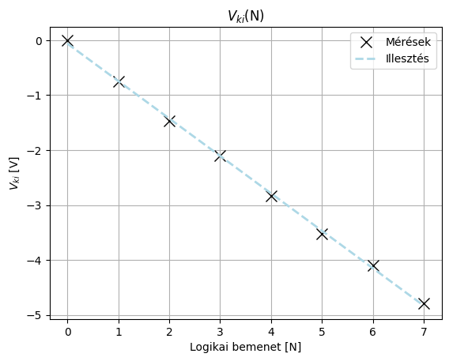
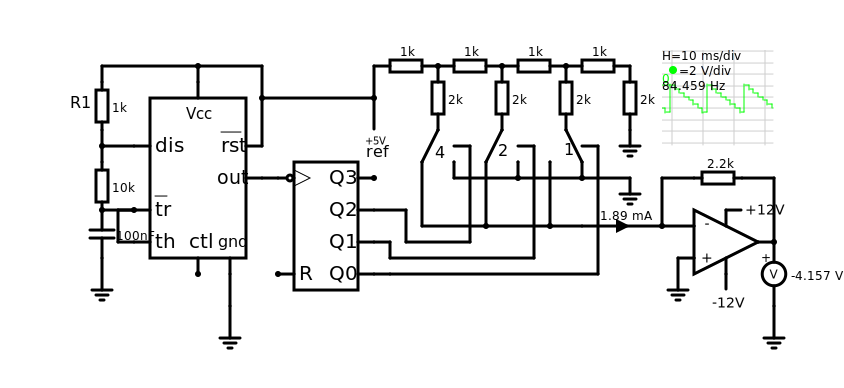
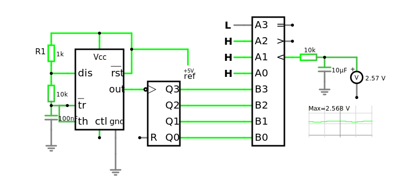

# Jegyzőkönyv 7 számolások


```python
import pandas as pd
import numpy as np
import matplotlib.pyplot as plt
import schemdraw
from schemdraw import logic
from schemdraw.parsing import logicparse
from sympy import symbols, Not, Or, And
from sympy.logic.boolalg import simplify_logic
from tabulate import tabulate
```


```python
def logic_form_print(formula) -> None:
    print(str(formula).upper().replace("|", "∪").replace("&", "∩").replace(" ", ""))
```

## 1. feladat: DAC

A feladat egy Digitál analóg konverter készítése, ami a fizikai kapcsolók helyett egy 74HCT4053 chipet használ.

### Áramkör

[](https://falstad.com/circuit/circuitjs.html?ctz=CQAgLCAMB0l3BWEBGGAmOaDsWDMkAONANgE5SsQFIrxcqBTAWmWQCgAlEXNENNCDz5ZeNGmBpIxUaAjYAPPhDQF6YXiuLgUWgE4MAZm10hSW5KV5m+CLTQxw2Ad24aBrlJajHT5r8mIaC1EUeB8AoK9+CGCoUMcTaM8NAgJkuNQEj1jrWKCwkwj0orRbOIdIHyTYpNK7PgK+VPSVNLrysIBzJray1uEQyoBlXxsta36gkAMAQwAbAGcGcrYRkrKS5qnZxeX7Vb53dtqtlGn5pZXFfhTkPnwmiBjzBRQ+oh1lAiRnvlfSegqGKQO4qSi-MDOJT2ZoCGj4CCVFzILBafoorQI7zI5ApNKsXhYpEoXHcSAxVFkxFQjFU6F04lwun9Ilsbos8k9VzSYkEGFpPncBCiGlgL74sVCkUuDBtWGEKXYkCC3DClCS1XS9WCNWyxWMhWa+lGyq4LD2CSKnjwtV3MRQ61WtUmtncXCYgiCd3gAJxYm4b24T1W4OVEwSeGco1Ew6OFxgX3utJgIRJpUpwnEZOpzn+jB0x0u+NwOkZhkO51R-OsgAOdEz2d4Zfo9u6ZfbQjAxER3gkpCtWZ9mMHdugWiYxGgATQZkCpGoAbQQhgkCXds43GDAa0Ccx3ukltJPNkG6DTxLZ-rfvANBYgxkciAA)


```python
from scipy.stats import linregress

N_be = pd.array([0, 1, 2, 3, 4, 5, 6, 7])

V_ki = pd.array(
    [
        -649 * 10 ** -6,
        -743 * 10 ** -3,
        -1468 * 10 ** -3,
        -2103 * 10 ** -3,
        -2833 * 10 ** -3,
        -3529 * 10 ** -3,
        -4100 * 10 ** -3,
        -4794 * 10 ** -3,
    ]
)

fit = linregress(N_be, V_ki)
fit_y = fit.slope * N_be + fit.intercept

# plot v_ki by v_be
plt.plot(N_be, V_ki, "x", color="black", markersize=10, label="Mérések")
plt.plot(N_be, fit_y, "--", color="lightblue", linewidth=2, label="Illesztés")
plt.title("$V_{ki}$(N)")
plt.xlabel("Logikai bemenet [N]")
plt.ylabel("$V_{ki}$ [V]")
plt.legend()
plt.grid()
plt.show()

# create table and show it
table = pd.DataFrame({"v_be": N_be, "v_ki": V_ki})
print(tabulate(table, ["#", "Bemenet [N]", "Kimenet [V]"], tablefmt="tsv"))
```


    

    


      #	  Bemenet [N]	  Kimenet [V]
      0	            0	    -0.000649
      1	            1	    -0.743
      2	            2	    -1.468
      3	            3	    -2.103
      4	            4	    -2.833
      5	            5	    -3.529
      6	            6	    -4.1
      7	            7	    -4.794
    

## 2. feladat: Fürészjel


### Áramkör

[](https://falstad.com/circuit/circuitjs.html?ctz=CQAgLCAMB0l3BWEBGGAmOaDsWDMkAONANgE5SsQFIrxcqBTAWmWQCgAlEXNENNCDz5ZeNGmBpIxUaAjYAPPhDQF6YXiuLgUWgE4MAZm10hSW5KV5m+CLTQxw2Ad24aBrlJajHT5r8mIaC1EUeB8AoK9+CGCoUMcTaM8NAgJkuNQEj1jrWKCwkwj0orRbOIdIHyTYpNK7PgK+VPSVNLrysIBzJray1uEQysV+FOQ+fCaIGPMFFD6iHWUCJGm+WdJ6FRjIMZVKVbBnJXtmgRp8CEqXZCwtfputC+9r5BS01l4nq5RX7kgY25-S5HB5A45g75nMH9L5sbow-49VzSb4EE5pNHcBCiEFgJbvPFYnEuDBtU6EInPECY3DYlCE2nE+mCOmkymQimM8Fcyq4LD2CSUnjnOljMRHYVCuk8uHcXCPAiCeXgAJxb64ZW4RVC7WVEwSc6IrlfPgOI5gVXytJgIRWqk2z7Ea22xHqjBgyUylwGsEOiES6VG92wgAOdEdzt4fvo4u6fvjQjAxEu3gkpCFTpVj0zYugWiYxGgpDRZACYAQyFwN0BMEgaCr3i4WqVWgtj2V0kFvxRsk43G1Pub4bV4BoLEGMjkRWs7RnzV2+XgS8cRRKZRK84a8WXYRK7natU37syO8cLw0IhQKgGVNebUvd+4me+oOwvBql5fUQfXiHkMFb42Hcn5HAel7tD6L7XnayZPmkX6fAOaR-qBZQ+mA1pwFSTA0oiBaCK6bBliA+EQmC1pxEgUggAYACGAA2ADODDYcghKxCwhJst8OH2O4vE3jxbExF4Al5EcLC-H6klRlhlTdDJw6KUmKY8UkdpMGydpqe4Gr5upz4SepyqaZyHZGYKekkVp5kuKZ968JpAEgQpUJDk54iquKADG1mWSZbm6igsCnqeyDMJQaDQHihBEOoCAEMQqDIPBIXsCYHlIplVmLmefn2JemX9GpAFlEVIGKJp4G4BAmmsny2iqhw6X5Q0aRFWUuVEcQSD2eCLBRIKrZFuQo2kNQy7sC4trKrBOVHHNs2CIZ3rIUhcH2shma2itHjoZh4oSPQkqgn6gHnAQAD6yaXZAl3yAQrzhZdCAheNAhomxyZprdIU7JdLCXcgl1oCDWASm4tWYkkPHQ-xmLiXZwnpJliOtRxULcWwQA)

## 3. feladat: PWM

### Tapasztalat

A 220 mikrofarad kondenzátorral sokkal egyenesebb a jel, mint a 10 mikrofarados kondenzátorral.

### Áramkör

[](https://falstad.com/circuit/circuitjs.html?ctz=CQAgDOB0YzCsICMZICYaoOyYMxgByoBsAnCZiHBAgCw6UCmAtIogFABKIOqIqqNbryy8IEGtXBSUcNgA8+g1Pno1h+IiEGJNAJwYAzNgHcQTfBDyCmRQVfBsd129zCDLbkPi3SpCAwCGADYAzgwOpiw02iS8UUoEEWYWfALJECJJ8Uix6TmiJmasvHRxxVowDgDmRYglPLUlLmKFTPx2RN5tiTidWe3cvWYDvd5grSND3d44Q+ORApZT6DNzE4mZbRJ8mAU1W5b41otaOtJsAMbD27OaB9xHUojQsK9vMIjMFKiQcDzE5Both0qHICBQHzYumuGXwXROtyerwm202J2UYxRGTgd3RuwcCja+NQOGOcGEOAo2k0HHY0PuKxhfBxSJgjiICGmiggLFyJ00NEgZGFZCob3YpkQ0W4fQaoySDQkEClgiVCuEaXMGTS8zyAy1+SyKsN90QuV1ptyDMS4wAhCAACaGAIAVyCABcpABBHAAGi9qH9iH9YF9ACE-WHA2Hg2GIAAdACOvoAfL6ADwgC4ukLugD2AFt4yEgnmqgBLK5esMAYQAIsXq-Wk8gwPGAHaIAD8PeLYB7XaTYGQHa93cHIS9-cHieHbfb1e7jbjM7no9riGXNbbs5H7YHE4PQ+HHbYjONiEwmjNvEvmggTsCbs9knGABkkNK70g6kgr75AlCcJwTYD9jXPX9GWVEBALCSgHDA6UTnKE5oNg4CEM-JR8RQ-E0OCOCQNMOVPGNexdTlIYyLWaF0RuTxUKQZErnsDFXCUbYxBeD5hl+OBMGQTBCBIHAqEwGgxhedgalYuF2PklpiIYm4+lQtgAAcZW8BFZXQbhzgkehMkRNU1UsEgAH1bAssALIkEh8AsuAbMgRALJYCz2CAA)
