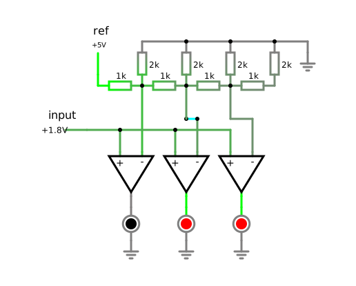
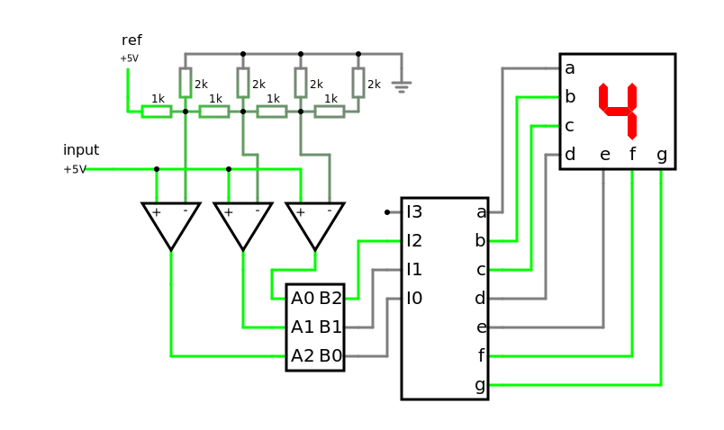
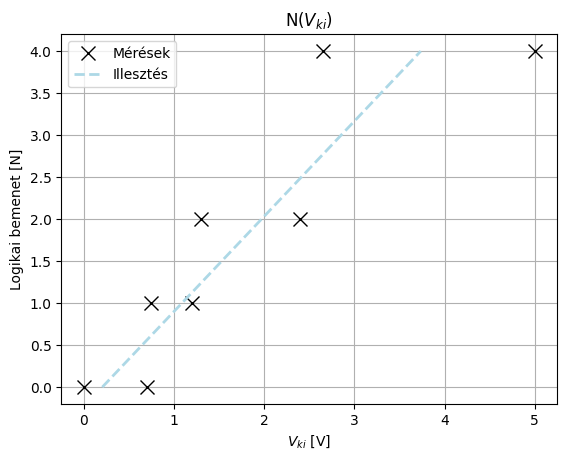
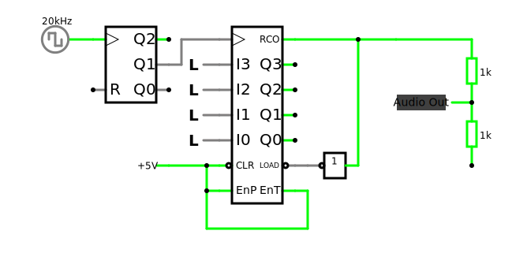

# Jegyzőkönyv 8 számolások


```python
import pandas as pd
import matplotlib.pyplot as plt
from tabulate import tabulate
from scipy.stats import linregress
```

## 1. feladat: ADC

A feladat egy Analóg Digitál (C)konverter készítése.

### A
#### Áramkör

[](https://falstad.com/circuit/circuitjs.html?ctz=CQAgDOB0YzCsICMZICYaoOyYMxgByoBsAnCZiHBAgCw6UCmAtIogFABKIOqSmR3XolT5wYmtTEQUcNgA8QqBK1F0kqRCBpIBAJwYAzNrpAkBw0WaQleEdDDYB3QXwE9rt46fM2dERL7+sF6IRP6+qKjaAbZIwSaR0RH4ojFiyA4m7mlWaUGZfuqpYR5i9mBeiUWKUaV28Yop1SKpgYrBzlYt3nVOro2p-IoS4H2IQ1H+JZOjzqF2I-O9zlVpVTMVK7UzSgIbfbvDdnB7TZs6iicgRNqH5zeX5jS3V+eIz481LwLn61frZzGH2672+s2utyaDzubFCvHwEBwRFECK0oUUIAAJoYAIYAVwANgAXJgEhiYpBSKBgdhwwpI4oQGjo3jYgz44mk8mU6TU2lEXgzBlHNF7LG4wkkskUzS8lA0tgAcxFzL2IzosQqyqWqsKGqkSpAqN1xvc0k4F0OTHcd3E-kgojlkFkCiYIxmTDV9GiAgAlgA7AAOeKJhpwSKQH3D5hK5pWTQsX2qv1qiaWibeJUTuRE4Ojke0+YzfVRODg8MRyPBSzLQhKwt+I1rIobbBxRrsTVL5aNlHSsFgimd7yIARSeAkJDL5gdcQHbcKIPrPdECHyA6QaHwRDgNHIYH4YFQ4anm9SA4q7Z2TSFK7768HKEwNMwu5w+DgZj3wmUs4yHQGaoi1zCp324CAADFZTEBAWBAAA1AB7YkcUVBg2CAA)

### B
#### Áramkör

[](https://falstad.com/circuit/circuitjs.html?ctz=CQAgDOB0YzCsICMZICYaoOyYMxgByoBsAnCZiHBAgCw6UCmAtIogFABKIOqSmR3XolT5wYmtTEQUcNgA8QqBK1F0kqRCBpIBAJwYAzNrpAkBw0WaQleEdDDYB3QXwE9rt46fM2dERL7+sF6IRP6+qKjaAbZIwSaR0RH4ojFiyA4m7mlWaUGZfuqpYR5i9mBeiUWKUaV28Yop1SKpgYrBzlYt3nVOro2p-IoS4H2IQ1H+JZOjzqF2I-O9zlVpVTMVK7UzSgIbfbvDdnB7TZs6iicgRNqH5zeX5jS3V+eIz481LwLn61frZzGH2672+s2utyaDzunAuhyY7ju4kk0igsgUTBGMyYezU0QEAEsAHYABwArgAXNgAc24OCe2hw9MK0gOTQsX2qv1qHKWHLeJQ5uRE4KZDLp5hFFQAhiB8HYmvLuHBeKIEPlYHZIHB3kQAik8BISDgrspNTLCiCSibVZR0ub-Gh8EQ4DRyGB+GBUEzjXaMsFZTsmjMbXK7RrYFBMGBxq6cPg4GY3cIEGbNWzUiKxVy2Ig4BQ3eLXdEPhAKKyAhQeBBDcreLWaH1nqorERaoXwW3tB2u4pMJ5nM2tA9E7waA9zqPh9op1gB1oaKp3CcIHR5yutMvpv3wUOJKurPvd4eYFouiNzkP6aoldfd7eiDf6qJL0r0C29gRd4uJdPf5eHmzcdoiGACQIEDtxh+Jtcg+IdQW-VI4J-WtzlvfBtFvFVwSWUNcMfcEQ2wkMCIqABCEAABNDGlMkABsKTEABBMAABomMQdjeAAIVQVjuM47iIAABV0AkAHsxIpABPAAdABnaiAGNxOokwAH51MQWSAEcMlkoktLAXSY2Mol9J0mBtMMzSTJgAy2HfUojyqI8IGogxaIY8NCKaFymmzX4AuZat-z6UK71rO9ziigiG3cGKwG7RE-ISjM-1C4DRXQDKcrcsZfCPNJooK+sCJIl9Ss3IQSjXHDauya1SL6dDMNXCcWvapIxw6+NhhAAAxTRUQQFgQAANXEhjpWpBg2CAA)


```python
V_be = pd.array(
    [
        400 * 10 ** -6,
        700 * 10 ** -3,
        750 * 10 ** -3,
        1200 * 10 ** -3,
        1300 * 10 ** -3,
        2400 * 10 ** -3,
        2650 * 10 ** -3,
        5000 * 10 ** -3,
    ]
)

N_ki = pd.array([0, 0, 1, 1, 2, 2, 4, 4])

fit = linregress(N_ki, V_be)
fit_y = fit.slope * N_ki + fit.intercept

# plot v_ki by v_be
plt.plot(V_be, N_ki, "x", color="black", markersize=10, label="Mérések")
plt.plot(fit_y, N_ki, "--", color="lightblue", linewidth=2, label="Illesztés")
plt.title("N($V_{ki}$)")
plt.xlabel("$V_{ki}$ [V]")
plt.ylabel("Logikai bemenet [N]")
plt.legend()
plt.grid()
plt.show()

# create table and show it
table = pd.DataFrame({"v_be": V_be, "N_ki": N_ki})
print(tabulate(table, ["#", "Bemenet [V]", "Kimenet [N]"], tablefmt="tsv"))
```


    

    


      #	  Bemenet [V]	  Kimenet [N]
      0	       0.0004	            0
      1	       0.7   	            0
      2	       0.75  	            1
      3	       1.2   	            1
      4	       1.3   	            2
      5	       2.4   	            2
      6	       2.65  	            4
      7	       5     	            4
    

## 2. feladat: Programozható frekvenciaosztó


### Áramkör

[](https://falstad.com/circuit/circuitjs.html?ctz=CQAgDOB0YzCMBWAbAJgSAzADhZA7KgjnACwYCc5YSJICE6ZdApgLRxwBQAMiKzZjC1W5JINoQIAMwCGAGwDOzOuB58BGDGJFjNYySFmLl6MGv60tWPqMxJrBo0pVneFkCRg2xng9PnOppwASnwoKLQoeChh0SBRMRAxKLBJkOi4plAInCQocOqRcXBiCeAe5QwuIXxwKNZkMexIEI2VHlV+6ZwA7rX1HhhNWK1Dqn3uJAKsIx4CZhOzbZNjC3xLYzOt873r28KzCHXje3THJNZHibsXZzG3UxI3DRr3O31jbQ+rz4MxAm01mMyhxknE1qD4sVzj8AJIgWxtAGrbJ0XaQtqIn4lYThIpNOAEKGJTDlLJOZQQ44glrEk4lJJxNClcGcABO8WQmAQyS5ZQgcFg7M5PmBXIwPPKgpgnHyBWZ3JicHIMQlJIwIBGXi4E0hZXc-N27GOGCEtWprN1A1NwkhNtUQA)
