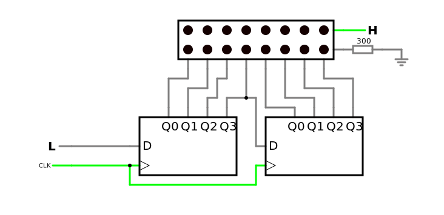
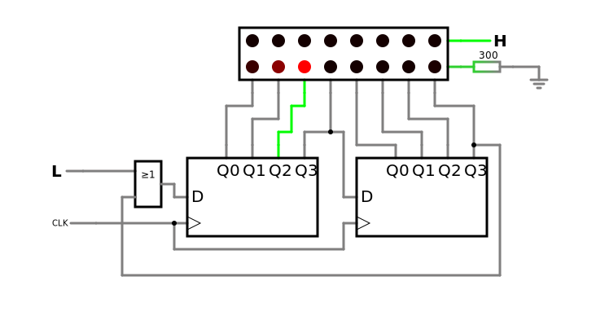
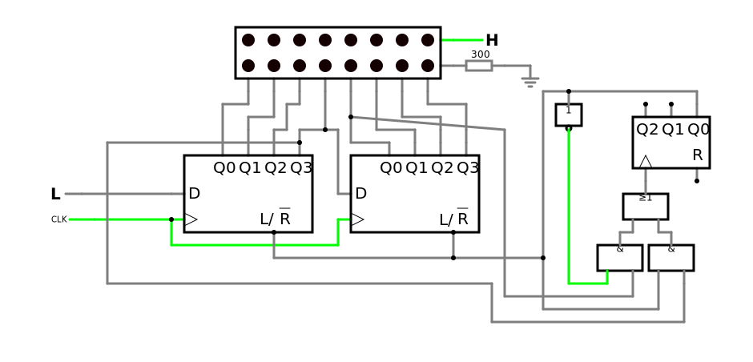
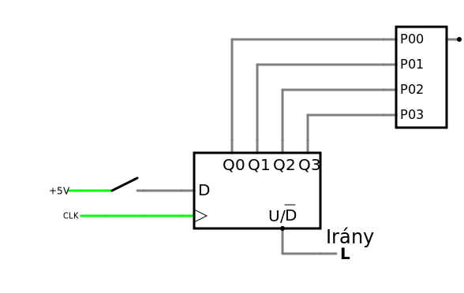

# Jegyzőkönyv 9 számolások


```python
import pandas as pd
import numpy as np
import matplotlib.pyplot as plt
import schemdraw
from schemdraw import logic
from schemdraw.parsing import logicparse
from sympy import symbols, Not, Or, And
from sympy.logic.boolalg import simplify_logic
from tabulate import tabulate
```


```python
def logic_form_print(formula) -> None:
    print(str(formula).upper().replace("|", "∪").replace("&", "∩").replace(" ", ""))
```

## 1. feladat: Bit shifterek

A feladat megismerkedni a 74LS194es shift-register használatával.

### A
#### Áramkör

[](https://falstad.com/circuit/circuitjs.html?ctz=CQAgDOB0YzCsICMZICYaoOyYMxgByoBsAnCZiHBAgCw6UCmAtIogFCL4kguZEh4aPRDSGDwIIWDYAlHllQCi+HjnRKViEIuQRUkBPoQQUcNgBl5mRThz8m42-xMgAZgEMANgGcGlcGwA7lY2dsJ8AmHSwbz8dipMChoBnNxqAmBCRGKZElJBwvxJLEVwzgWxyZU0MAExiBE1EOlNdQI2yu2StdFdTl2oZQE1CCyIOqKqE1kiQor4FayKxUvaqPn142tCTPh66227+zt72gSHp8WXNRd6N0w0KusmFY-a92-oKr0PT9Y8nyGP0B9nSg3KMTBQwcywOPzBBxK20OiCKiNRZ2+BQx4KQRXOPxxQyJEIGxNKpJIRX+n3+vVpik+BOxqD+OlZ2iBLKeQ0uXOCfP4l2ZwVWXyQW2ebTFN1RdxeoqI8rxejp2JIy3+iA1yN62thQlmuuxk1QByN4ukAHNtFqIkl9RJeg77bKItIAE5ICINIpu5wZaSWX1IU3myYQLQeHx+YxsIA)

### B
#### Áramkör

[](https://falstad.com/circuit/circuitjs.html?ctz=CQAgDOB0YzCsICMZICYaoOyYMxgByoBsAnCZiHBAgCw6UCmAtIogFCL4kguZEh4aPRDSGDwIIfjYAlHllQCi+HjnRKViEIuQRUkBPoQQUcNgBl5+FeKZqI4kyABmAQwA2AZwaVwbAO5WNmBCTKioYiF+gbz8OMrymIrxKmAcXALJUUSRQhB5AcL8CkXacPxpMYh8GsI1NDDRdfwNDoqtTWq1XR2VmQLx-ajlfg0ILIg6oqpTQkQiQorSVZPaScKr4QUrils8+HoRTUwH2kcnegTHpyUX2g3Xeg9MNCoRJoUvb8+v2ld9XzWikBwwqn1+oJmZTBMS6kLsuyOALh50QxSRnzRZ1CWPQqUKuJGuP+mOKRLJMKG5OhTRIxXWEPWfUZ7TeJMCkze605NL6PMhNxGfUF-Bu7KQmyurF2Dz5mweaKeHw5RCVSFVQKaiBIu25OuxWv1ewWBr502N5pJAHNNdV6Tp9crbTV3kgamkAE5u-h2+4QX0OGAWb1Ic1HE3+lweby+PlG9Z7Ep9RMJo50RTJtNdMIPdPHV15nMOQZpRBwYF7ezCfVVvQSMwxV04QZhI7NyksGvqWKZJ09qv9ktsIA)

### C
#### Áramkör

[](https://falstad.com/circuit/circuitjs.html?ctz=CQAgDOB0YzCsICMZICYaoOyYMxgByoBsAnCZiHBAgCw6UCmAtIogFCL4kguZEh4aPRDSGDwIIWDYAlHllQCi+HjnRKViEIuQRUkBPoQQUcNgBl5+FThz8maiLf4mQAMwCGAGwDODSuBsAO5WNnbCfALh0iG8-HYqTAoagZzcagJgQkRiWRJSwcL8ySzFcC6FcSlVNDCBsYiRtU6KzfUCigkdknUx3c7dqOWBtQgsiDqiqpPZIkKK+JWsiiXL2qgFDRPrQkz4ehvtewe7+9oER2dD9le1l3p3TDQqGyaVz9qPH+gqfU8vmEU-20wz+32GDhWoMqGWu0x2R1hh1KCL+iGKyPR51+hSxcLxFzRZX4eOhIVhw1JFRCJGKgMkAMUfW+d2+hNxqEZSE5IOp3JewyuZJAQv4V3ZITWPyQ21e7Sld3RDzekqIyqQat58pIUJJOtRuP1qEOcwNkqmxqEpul0gA5tp6Y06Tp9SqHTpInKnYEAE5ISLer2RJwwCz+kkWk1TCBaTy+fzGd42fC7D40LF9b04FPhyQZpN5klNfOS4vFayFo54+lJYbJP5wkpw0Q42LN76HFupKgCHN0Tp93raCRmRA9rv9yRpodMygcOCtLFddPxaLD6iFLvZoST7ftXd9jJdPp7tp7vcnnOnuoXzc3wdOZT7pfhFcdN2OKc2J9dk8-j7LhkfRyjQOQ9BAoGbNoFZvpyKjPG6k4IZIGSTsBnYdjutLtJakjYZBeEVAAHjwRDxJguw9jg2CSOcIDmAA9GwJFPFo1G7FgAg0cUEAyMxSD4GxFFICQCDURQPEgHxJFjjYmAII0YiYPBdGMZuYE0PhGkfMy2nwRpQGFCBYFynCwF3M2Lx3Jmmr4rZ9J-FcNaijhMFnEhZzMgBfbTm86JiDmzZUiARCmvQrgQHGfj7lcnbiq2DJ6Bcn42kZFbSnBlbSAAku+CIpaCUAIGY5LqNKKWHCeZUXJlqWlXowyfr+d4QRpdRoYaKyOkawoshBXLSEAA)

## 2. feladat: Motor irányítás


### Áramkör

[](https://falstad.com/circuit/circuitjs.html?ctz=CQAgDOB0YzCsICMZICYaoOyYMxgByoBsAnCZiHBAgCw6UCmAtIogFCL4kguZEh4aPRDSGDwIIWDYAlHllQCi+HjnRKViEIuQRUkBPoQQUcNgHdhfDfNRjl4Czxoqc+IUxeTE-aQBkJGh8BRSDfCQAzAEMAGwBnBkpHS08VMMDg6QBCEAATBmiAVxiAFwkABRgAGkrEGrBUevoAHQgAY0K4koB7AFtmuJjugHMASzaQVrZ0FXwIESFWHVEJfKLS5OF+BS3tGhMnVO1MRSOZzaY549OrxGtpFKXr4URlqUOnhZBblYeeW+sAN8hy85yu5z+LG2+2+ehh0ji8hOAhw-CYqDsKPCWhKACdCgwPtYcKjbGJSZCdqiVOjMdTHHImOISWiWViJBAYcYOQZDszSejkWzpAAPEAUfb0IicsD8ISYgCSuIAhwA7ACebDFTCI-BwmAQnj1mDS2ggAFUAPRa5wIfUeHBafUUbYQAAibCAA)
