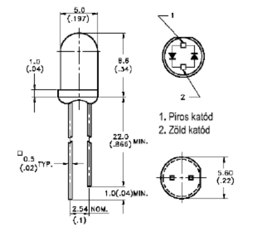
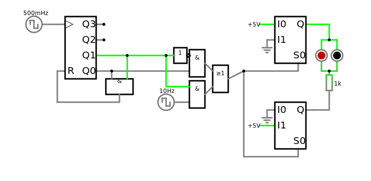
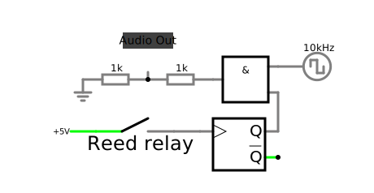

# Jegyzőkönyv 10 számolások

## 1. feladat: Kétszínű LEDek

A feladat megismerkedni egy kétszínű leddel és megidomítani.

### Áramkör

[](https://falstad.com/circuit/circuitjs.html?ctz=CQAgjCAMB0l5A2ATAVhATgdA7LlBmBFFADgBYFsEEQVJaQz9aBTAWjDACgAlRkjDXqYoIJFGhokksTPowUvEPiT1UNJNnHrR4sGpnS08yVzDJa6PUgEor4e+IAmLAGYBDAK4AbAC5tvFidwURNIbnNxZDIHKKQYsBsxEBcPH39A4PoIMO4AdxBo8CSESAFEgUguAtLy+yKweyqasuLbewqoasLWxvE7PSazcn41LVokzXFsrgBzUbFxshI1Ekqu+eXspK3wMhj5YZjdkRQkkRmClCpFqNaprpaBB9qxMkOntp6BC+7X05uvz4Jxo+x+QlE7wY8gkimBK2UkGOy0RB0h9GMoVMACdvm96K8+qJ9HAzAhjuDBFT6GiYWgPN4AM4sR7gG46FE6Zr8MQoUF1abdMD7cClWKij4S8WqAWspjiQi2EWK1koEVE+Xi7ky8UqbJDMB0NkaXrsqFqUSKArChIdMVE7nmfV6MU6x1251iVqO9l8434roASTEayleqlJjQVvFTtuEbMRvDYBu+DO-otUYT9HD8Wzadzukt3QesZs5TF2vGpfGSHirIetZiObrVUNCoQz1a7zU3uSmYKqb0KY7Wu6g4DKsbcrgXoEmod3Xn9k1KqqQA)

## 2. feladat: Reed relé

Mágneses tér érzekelés

### A

#### Áramkör

### B

#### Áramkör

Monostabil paraméterei:
C = 220 qF
R = 10k Ohm

## 3. feladat: Fotókapu

Csík számolás

### Áramkör

